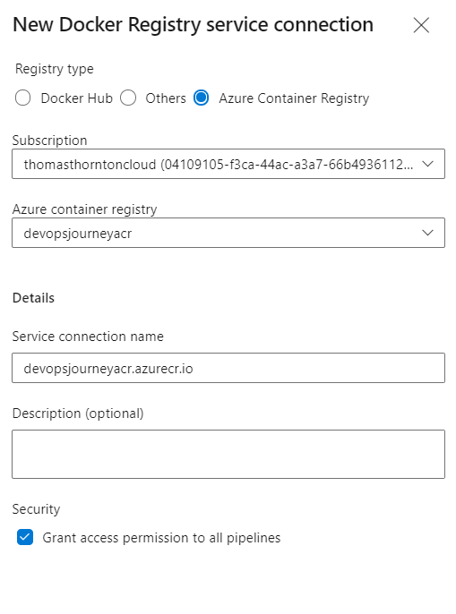

# Deploy sample Application to Container Registry

This lab is to deploy the same Application to Container Registry

1. The Docker image can be built and ran locally to test - see [here](docker-image-locally.md)

2. We want to run this Docker build and publish directly to the created Azure Container Registry in lab 2. 

3. Create a new service connection for ACR access.
   - Within your Azure DevOps Project – select **Project Settings**
   - Select **Service Connections** -> **Docker Registry** -> Select registry type: **Azure Container Registry**
   - Select correct ACR and create service connection name. I have given devopsjourneyacr.azurecr.io as my service connection name

6. Copy the app folder to Azure DevOps repo

7. Update pipeline in Azure DevOps repo with the below updates:
- [Updated variables](labs/3-Deploy-App-to-ACR/pipelines/lab3pipeline.yaml#L23-L28)
  - repository: ACR repository name
  - dockerfile: Dockerfile location
  - containerRegistry: Service connection name of container registry
- [Add Build Stage](labs/3-Deploy-App-to-ACR/pipelines/lab3pipeline.yaml#L125-L138)

8. Run pipeline, you will see an additional stage on pipeline

9. Reviewing in ACR, you will see the image 

